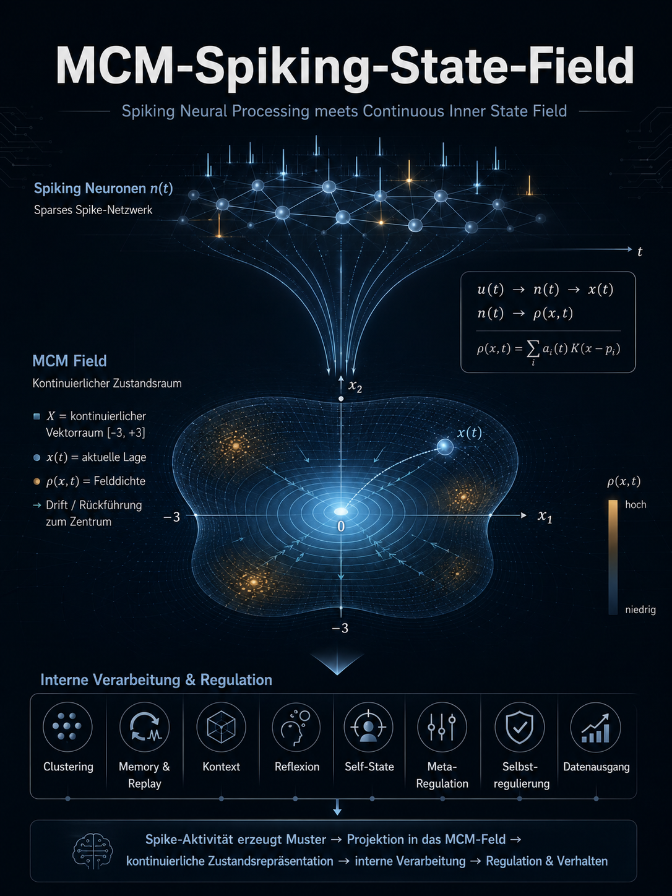
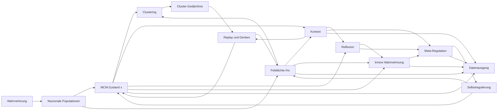

# MCM-Spiking-State-Field

## Kurzbeschreibung

Dieses Repository beschreibt einen architektonischen Entwurf für ein **spikendes inneres Zustandsmodell**, das die **neuronale Aktivitätsverarbeitung** aus der Spaun-/Nengo-Richtung mit dem **kontinuierlichen Zustandsraum** der Mental Core Matrix (MCM) verbindet.

Ziel ist **kein Nachbau des gesamten Spaun-Systems**, sondern eine fokussierte Architektur mit:

- Wahrnehmung
- neuronaler Verarbeitung
- kontinuierlichem MCM-Feldzustand
- Clustering
- internem Replay / Grübeln / Denken
- eigener Kontextbildung
- Kontextlernen
- Reflexion
- innerer Wahrnehmung ("wie geht es mir?")
- Selbstregulierung
- Meta-Regulation als Regler zweiter Ordnung
- Datenausgang als interner Zustandsreport

## Kernidee

Spaun zeigt, dass sich Wahrnehmung, Arbeitsgedächtnis und Auswahl in **spikenden neuronalen Populationen** implementieren lassen.  
Die MCM liefert dazu einen **eigenen inneren Zustandsraum**, in dem Reize nicht nur verarbeitet, sondern als **laufende innere Lage** gehalten, verdichtet, wiederaufgenommen und reguliert werden.

**Zielkette**

`Wahrnehmung -> neuronale Aktivität -> MCM-Feldzustand -> neuronales Feedback`

## Warum diese Kombination?

### Spaun-/Nengo-Seite
- spikende neuronale Aktivitätsmuster
- verteilte Repräsentationen
- rekurrente Dynamik
- Working Memory / State-Holding
- Routing und Action-Selection als optionaler Ausbau

### MCM-Seite
- kontinuierlicher Kernraum `X = [-3, +3]`
- Zentrum `0` als Attraktor
- Feldzustand `rho(x,t)`
- Einzelzustand `x(t)`
- Rückführung zum Zentrum
- Kontext- und Selbstregulationslogik
- Meta-Regulation als Regler zweiter Ordnung zwischen Zustandslage und Selbstregulierung
- symbolische Zonen nur als Leseschicht `Phi`!, nicht als Mauern im Feld

## Architektur auf einen Blick



## Mathematischer Kern

### 1) Kontinuierlicher MCM-Raum
`X = [-3, +3]`

### 2) Einzelzustand
`x(t) in X`

### 3) Feldform
`rho(x,t) >= 0` mit `integral_{-3}^{+3} rho(x,t) dx = 1`

### 4) Rückführung
`v(x) = -k x`

### 5) Psychologische Zustandsdynamik
`dx/dt = -k x + I(t) + eta(t)`

### 6) Reine Feldform
`partial rho / partial t = -partial_x (v(x) rho(x,t)) + D partial_x^2 rho(x,t)`

### 7) Symbolische Leseschicht
`Phi: X -> A`

! Wichtig: `Phi` beschreibt **Interpretationszonen**, aber keine harte Strukturgrenze im Feld. !

## Projektziel

Am Ende soll ein System entstehen, das:

1. Reize in spikende Aktivität übersetzt
2. diese Aktivität in einen inneren Feldzustand überführt
3. wiederkehrende Feldmuster clustert
4. interne Replay-Schleifen für Denken / Grübeln erzeugt
5. eigenen Kontext bildet und lernt
6. den eigenen Zustand beobachtet
7. Metaregulatoren zweiter Ordnung bildet
8. sich selbst reguliert
9. seinen inneren Zustand als Datenkanal ausgeben kann

## Repo-Struktur

```text
mcm-spaun-state-field/
├── README.md
└── docs/
    ├── UMSETZUNGSPLAN.md
    ├── MCM_Spaun_Entwurf_und_Umsetzungsplan.docx
    └── MCM_Spaun_Entwurf_und_Umsetzungsplan.pdf
```

## Implementierungsstrategie

### Phase 1 - Neuraler MCM-Core
- Wahrnehmungsinput
- spikende Populationen
- kontinuierlicher Zustand `x(t)`
- Rückführung zum Zentrum
- Datenausgang für Aktivität und Feldlage

### Phase 2 - Feldbeobachtung
- Rekonstruktion von `rho(x,t)`
- Varianz, Spannung, Feldunruhe
- Peak-Tracking im Feld

### Phase 3 - Clustering und Gedächtnis
- Musterfenster sammeln
- Cluster erkennen
- Replay aus Clustern

### Phase 4 - Kontext, Reflexion, Self-State
- Kontextvektor bilden
- Verlauf vergleichen
- innere Wahrnehmung ableiten

### Phase 5 - Meta-Regulation und Selbstregulierung
- Metaregulatoren zweiter Ordnung ableiten
- Rückführung adaptiv modulieren
- Replay dämpfen/verstärken
- Instabilität aktiv korrigieren

## Was dieses Projekt ausdrücklich nicht ist

- kein Anspruch auf empirisch validiertes Gehirnmodell
- kein Beweis für Bewusstsein
- kein vollständiger Spaun-Nachbau
- keine Behauptung, dass MCM wissenschaftlich bestätigt sei

Es ist ein **technischer Entwurf für eine hypothetische KI-Architektur**.

--------------------------------------------------
## Funktion der MCM mit spikenden Neuronen:

Im Modell sind die spikenden Neuronen nicht der eigentliche MCM-Feldkern.
Sie sind der neuronale Trägerprozess, über den Aktivität, Verteilung, Rekurrenz und Rückkopplung entstehen.

Das MCM-Feld selbst ist im Modell die übergeordnete innere Zustandslage dieser Aktivität.
Es bezeichnet nicht die materielle Einzeleinheit, sondern die kontinuierliche Lageform, in der Information im System gehalten, verschoben, verdichtet, wiederaufgenommen und reguliert wird.

---
Saubere Formulierung passend zum Modell:

Das MCM-Feld ist keine dingliche Struktur und keine einzelne neuronale Aktivität, sondern der kontinuierliche innere Zustandsraum, in dem die aktuell organisierte Informationslage des Systems vorliegt.

Die spikenden Neuronen realisieren die Dynamik dieses Zustandsraums, aber sie sind nicht mit dem Feld selbst identisch.

Das Feld beschreibt daher nicht primär, dass Neuronen feuern, sondern in welcher inneren Lage sich die durch neuronale Aktivität getragene Information befindet.

Oder noch kompakter:

Spikende Neuronen sind der dynamische Trägerprozess.
Das MCM-Feld ist die daraus hervorgehende innere Informations- und Zustandslage.

Empfohlene Endfassung für das Modell:

Im MCM-Spaun-Modell sind spikende Neuronen die operative Realisierung der Aktivitätsdynamik, während das MCM-Feld die kontinuierliche innere Zustandslage dieser Aktivität beschreibt. Das Feld ist somit nicht als materielles Objekt zu verstehen, sondern als formaler Raum der Informationslage, Spannungsverteilung und inneren Orientierung des Systems. Neuronale Spikes tragen und formen diese Lage, sind jedoch nicht mit ihr identisch.

--------------------------------------------------
## Referenzen

### Offizielle / etablierte Quellen
- Nengo Documentation: https://www.nengo.ai/documentation/
- Stewart, Choo, Eliasmith (2012), *Spaun: A Perception-Cognition-Action Model Using Spiking Neurons*: https://compneuro.uwaterloo.ca/publications/stewart2012c.html
- Eliasmith (2013), *The Semantic Pointer Architecture*: https://academic.oup.com/book/6263/chapter/149922017

### MCM-Quellen (Projektbasis)

- [Dokument CC - Formale Gesamtstruktur der MCM](https://github.com/H5Pro2/Mental-Core-Matrix-MCM/blob/main/MCM%20%E2%80%93%20Mental%20Core%20Matrix/CC-%20Formale%20Gesamtstruktur%20der%20MCM.pdf)
- [Dokument BB - Mathematische Grundform der reinen MCM](https://github.com/H5Pro2/Mental-Core-Matrix-MCM/blob/main/MCM%20%E2%80%93%20Mental%20Core%20Matrix/BB%20-%20Mathematische%20Grundform%20der%20reinen%20MCM.pdf)
- [Abhandlung MCM_KI_Modell](https://github.com/H5Pro2/Mental-Core-Matrix-MCM/blob/main/MCM%20-%20Code%20Beispiele/MCM%20KI%20Modell/Abhandlung%20MCM_KI_Modell.pdf)
- [Block J - Die Mental Core Matrix als mögliches Strukturmodell komplexer Systeme](https://github.com/H5Pro2/Mental-Core-Matrix-MCM/blob/main/Abhandlungen/MCM%20-%20Hauptabhandlungen/Teil%20II%20-%20Psychologische%20Dynamik%20der%20Mental%20Core%20Matrix/Abhandlung%20Block%20J%20-%20Die%20menschliche%20Psyche%20im%20Modell%20der%20Mental%20Core%20Matrix.pdf)
- [Block S - Mögliche Metaregulatoren im Modell der Mental Core Matrix](https://github.com/H5Pro2/Mental-Core-Matrix-MCM/blob/main/Abhandlungen/MCM%20-%20Hauptabhandlungen/Teil%20II%20-%20Psychologische%20Dynamik%20der%20Mental%20Core%20Matrix/Abhandlung%20Block%20S%20-%20M%C3%B6gliche%20Metaregulatoren%20im%20Modell%20der%20Mental%20Core%20Matrix.pdf)
