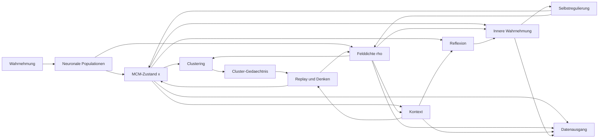

# MCM-Spiking-State-Field

## Kurzbeschreibung

Dieses Repository beschreibt einen architektonischen Entwurf fuer ein **spikendes inneres Zustandsmodell**, das die **neuronale Aktivitaetsverarbeitung** aus der Spaun-/Nengo-Richtung mit dem **kontinuierlichen Zustandsraum** der Mental Core Matrix (MCM) verbindet.

Ziel ist **kein Nachbau des gesamten Spaun-Systems**, sondern eine fokussierte Architektur mit:

- Wahrnehmung
- neuronaler Verarbeitung
- kontinuierlichem MCM-Feldzustand
- Clustering
- internem Replay / Gruendeln / Denken
- eigener Kontextbildung
- Kontextlernen
- Reflexion
- innerer Wahrnehmung ("wie geht es mir?")
- Selbstregulierung
- Datenausgang als interner Zustandsreport

## Kernidee

Spaun zeigt, dass sich Wahrnehmung, Arbeitsgedaechtnis und Auswahl in **spikenden neuronalen Populationen** implementieren lassen.  
Die MCM liefert dazu einen **eigenen inneren Zustandsraum**, in dem Reize nicht nur verarbeitet, sondern als **laufende innere Lage** gehalten, verdichtet, wiederaufgenommen und reguliert werden.

**Zielkette**

`Wahrnehmung -> neuronale Aktivitaet -> MCM-Feldzustand -> neuronales Feedback`

## Warum diese Kombination?

### Spaun-/Nengo-Seite
- spikende neuronale Aktivitaetsmuster
- verteilte Repräsentationen
- rekurrente Dynamik
- Working Memory / State-Holding
- Routing und Action-Selection als optionaler Ausbau

### MCM-Seite
- kontinuierlicher Kernraum `X = [-3, +3]`
- Zentrum `0` als Attraktor
- Feldzustand `rho(x,t)`
- Einzelzustand `x(t)`
- Rueckfuehrung zum Zentrum
- Kontext- und Selbstregulationslogik
- symbolische Zonen nur als Leseschicht `Phi`, nicht als Mauern im Feld

## Architektur auf einen Blick



## Mathematischer Kern

### 1) Kontinuierlicher MCM-Raum
`X = [-3, +3]`

### 2) Einzelzustand
`x(t) in X`

### 3) Feldform
`rho(x,t) >= 0` mit `integral_{-3}^{+3} rho(x,t) dx = 1`

### 4) Rueckfuehrung
`v(x) = -k x`

### 5) Psychologische Zustandsdynamik
`dx/dt = -k x + I(t) + eta(t)`

### 6) Reine Feldform
`partial rho / partial t = -partial_x (v(x) rho(x,t)) + D partial_x^2 rho(x,t)`

### 7) Symbolische Leseschicht
`Phi: X -> A`

Wichtig: `Phi` beschreibt **Interpretationszonen**, aber keine harte Strukturgrenze im Feld.

## Projektziel

Am Ende soll ein System entstehen, das:

1. Reize in spikende Aktivitaet uebersetzt
2. diese Aktivitaet in einen inneren Feldzustand ueberfuehrt
3. wiederkehrende Feldmuster clustert
4. interne Replay-Schleifen fuer Denken / Gruendeln erzeugt
5. eigenen Kontext bildet und lernt
6. den eigenen Zustand beobachtet
7. sich selbst reguliert
8. seinen inneren Zustand als Datenkanal ausgeben kann

## Repo-Struktur

```text
mcm-spaun-state-field/
├── README.md
└── docs/
    ├── UMSETZUNGSPLAN.md
    ├── MCM_Spaun_Entwurf_und_Umsetzungsplan.docx
    └── MCM_Spaun_Entwurf_und_Umsetzungsplan.pdf
```

## Implementierungsstrategie

### Phase 1 - Neuraler MCM-Core
- Wahrnehmungsinput
- spikende Populationen
- kontinuierlicher Zustand `x(t)`
- Rueckfuehrung zum Zentrum
- Datenausgang fuer Aktivitaet und Feldlage

### Phase 2 - Feldbeobachtung
- Rekonstruktion von `rho(x,t)`
- Varianz, Spannung, Feldunruhe
- Peak-Tracking im Feld

### Phase 3 - Clustering und Gedaechtnis
- Musterfenster sammeln
- Cluster erkennen
- Replay aus Clustern

### Phase 4 - Kontext, Reflexion, Self-State
- Kontextvektor bilden
- Verlauf vergleichen
- innere Wahrnehmung ableiten

### Phase 5 - Selbstregulierung
- Rueckfuehrung adaptiv modulieren
- Replay daempfen/verstaerken
- Instabilitaet aktiv korrigieren

## Was dieses Projekt ausdruecklich nicht ist

- kein Anspruch auf empirisch validiertes Gehirnmodell
- kein Beweis fuer Bewusstsein
- kein vollstaendiger Spaun-Nachbau
- keine Behauptung, dass MCM wissenschaftlich bestaetigt sei

Es ist ein **technischer Entwurf fuer eine hypothetische KI-Architektur**.

## Referenzen

### Offizielle / etablierte Quellen
- Nengo Documentation: https://www.nengo.ai/documentation/
- Stewart, Choo, Eliasmith (2012), *Spaun: A Perception-Cognition-Action Model Using Spiking Neurons*: https://compneuro.uwaterloo.ca/publications/stewart2012c.html
- Eliasmith (2013), *The Semantic Pointer Architecture*: https://academic.oup.com/book/6263/chapter/149922017

### MCM-Quellen (Projektbasis)
- Dokument CC - Formale Gesamtstruktur der MCM
- Dokument BB - Mathematische Grundform der reinen MCM
- Abhandlung MCM_KI_Modell
- Block J - Die Mental Core Matrix als moegliches Strukturmodell komplexer Systeme
